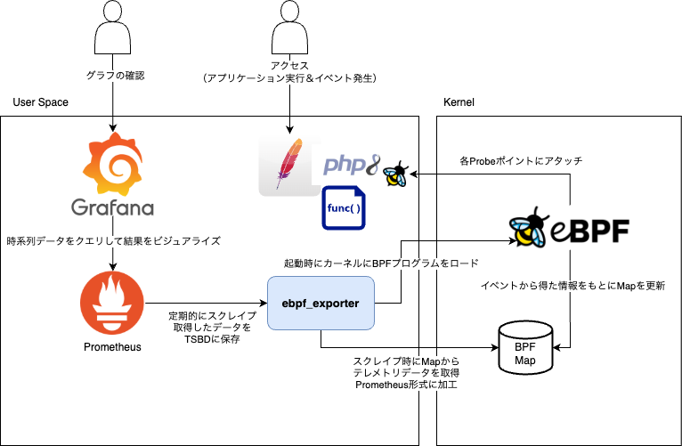
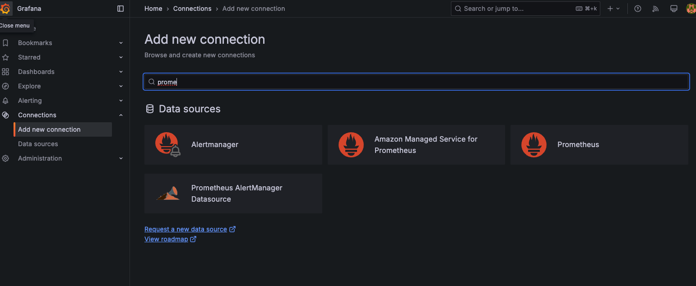
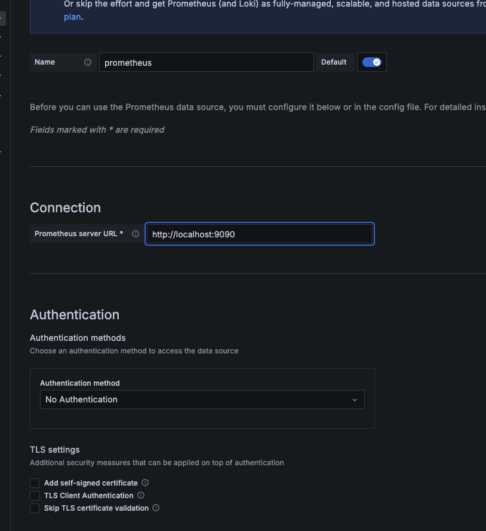
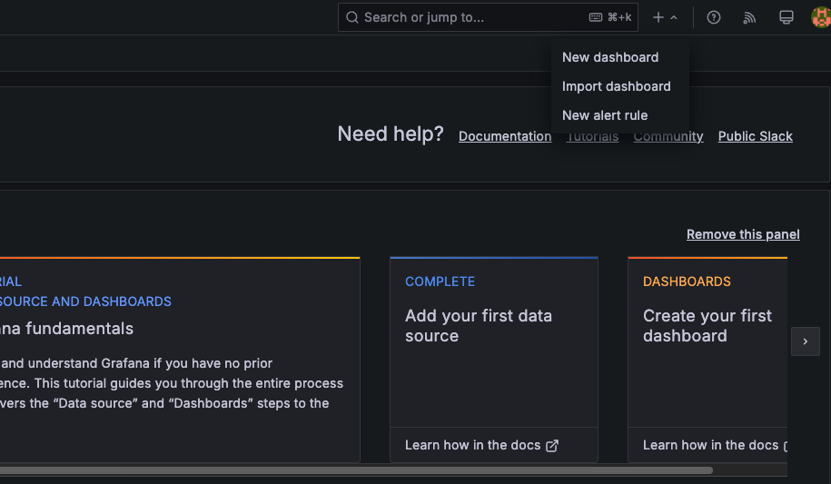
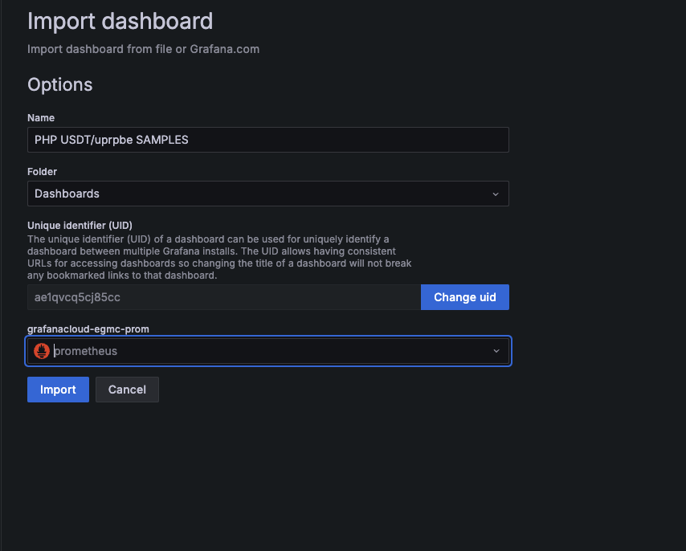

php-sessionless-conference-ebpf-workshop
---

# ワークショップ資料

## 導入

- スライド
  - https://speakerdeck.com/egmc/ebpftozhou-bian-ji-shu-woli-yong-sitephpapurikesiyonkodowobian-geng-sinaike-shi-hua-woyatutemiru


## eBPFの概要説明

※ 概要説明している間にパッケージインストール済ませたいのでそこだけ先に

### eBPF概要

https://ebpf.io/what-is-ebpf/

Probeタイプ

https://github.com/bpftrace/bpftrace/tree/master?tab=readme-ov-file#probe-types

### 今回の構成図




##  環境セットアップ(30m)

- sudoできるユーザーなら良いですが、便宜上デフォルトのubuntuユーザーを想定、必要な部分は適宜読み替えで
- ターミナルをいくつか切り替えるのでscreen/tmux等必要に応じてよしなにご利用ください

セットアップ後、ユーザーのホーム（/home/ubuntu）以下では以下のようなパスになる想定です

```
.
├── ebpf_exporter
│   ├── benchmark
│   ├── cgroup
│   ├── cmd
│   ├── config
│   ├── decoder
│   ├── examples
│   ├── exporter
│   ├── include
│   ├── kallsyms
│   ├── libbpf
│   ├── scripts
│   ├── tracing
│   └── util
└── php-sessionless-conference-ebpf-workshop
    ├── bt
    ├── images
    ├── mkdir
    └── setup
```

### イメージ確認
 - ubuntu 22.04 jammyを使用
 - ubuntu/images/hvm-ssd/ubuntu-jammy-22.04-amd64-server-20250112
    - ap-northeast-1の場合 ami-08f191dd81ec3a3de
    - Lightsailの場合 Linux/Unix -> OS only -> Ubuntu 22.04 LTS
    - ※ ローカルでのDockerイメージは利用不可です

```bash
cat /etc/lsb-release
```


### port開放

セキュリティ上の懸念は低めですが、気になる場合は作業環境のIPのみ許可してください

- 3000 (Grafana)
- 80(apache/php)

以下は公開の必要なし、使用ポート

- 9090(Prometheus) ※コンソール確認のため開放もあり
- 9435 (eBPF Exporter)


### 本レポジトリのclone

```
git clone https://github.com/egmc/php-sessionless-conference-ebpf-workshop.git
cd php-sessionless-conference-ebpf-workshop/
```


### パッケージインストール

```bash
sudo setup/01-packages.sh
```

確認

```
php -v
bpftrace --version
bpftool --version
```

### Apache/PHPセットアップ

systemd unitファイルをoverrideして環境変数を設定

```bash
sudo setup/02-apache.sh
```

確認

```bash
sudo systemctl cat apache2.service
```

サンプルソース配置

```bash
sudo cp -pr  setup/php-scripts/* /var/www/html/
```

### ebpf_exporterセットアップ

ebpf_exporterバイナリ配置

```bash
sudo setup/03-ebpf_exporter.sh
```

確認

```
ebpf_exporter --version
```


### Prometheusセットアップ

Prometheusバイナリの配置、config、systemd unitファイルの配置、有効化

```
sudo setup/04-prometheus.sh
```

確認

```bash
systemctl status prometheus
curl http://localhost:9090/metrics
```

### Grafanaセットアップ

Grafanaパッケージのインストール

```
sudo setup/05-grafana.sh
```

#### 初期設定

- 起動後、http://{Public IP}:3000 へアクセス
- admin/adminでログイン
- 任意のパスワードを設定

#### データソース設定

Prometheusを設定


`http://localhost:9090` を設定



#### サンプルダッシュボード取り込み

import dashboard


`setup/dashboards/` 以下のjsonファイルをアップロード



### bpf_exporterの設定、BPFプログラムのビルド

BPFプログラムのサンプルを配置

```
cd ..
php-sessionless-conference-ebpf-workshop/setup/06-ebpf_exporter_src.sh
```

## bpftraceを利用したトレース体験(10m)

本レポジトリ以下で

```bash
sudo bt/memc.bt
```

/mem.phpへアクセス

以下サンプル

```bash

sudo bpftrace -l
sudo bpftrace -l 'uprobe:/usr/lib/apache2/modules/libphp8.1.so:*'

# see https://www.php.net/manual/en/features.dtrace.dtrace.php
sudo bpftrace -l 'usdt:/usr/lib/apache2/modules/libphp8.1.so:*'


# opcacheを切ったりしてみる
sudo phpdismod opcache
sudo service apache2 restart

sudo bpftrace -e 'usdt:/usr/lib/apache2/modules/libphp8.1.so:php:compile__file__return { printf("%s, %s\n", str(arg0), str(arg1)); }'
```

ref: https://github.com/bpftrace/bpftrace/blob/master/docs/tutorial_one_liners_japanese.md


## ebpf exporterを利用した可視化の実装(40m)

### サンプルのビルド

```
cd ebpf_exporter/examples/
make

```

ビルドしながらサンプルを読む

- https://github.com/egmc/ebpf_exporter/blob/ebpf-php-sample/examples/php.bpf.c
- https://github.com/egmc/ebpf_exporter/blob/ebpf-php-sample/examples/php.yaml

### トレース実行

```
cd ..
sudo ebpf_exporter --config.dir=examples --config.names=php
```

#### ログの確認

```
sudo cat /sys/kernel/debug/tracing/trace_pipe
```

#### BPF_MAPの確認

```
sudo bpftool map

# php_compileのmap確認
sudo bpftool map dump id `sudo bpftool map |grep php_compile |egrep -o '^[0-9]+'`
```


#### exporter出力の確認

```
curl -s http://localhost:9435/metrics | grep -v ^# |grep  ^ebpf_exporter_php
```

#### Grafanaのクエリ結果確認
#### 余力があればコードを変更

## ユースケースについてのディスカッション（10m）

 - ディスカッションする


# その他参考資料

- https://speakerdeck.com/egmc/phpapurikesiyonniokeruebpfnoshi-isuo
